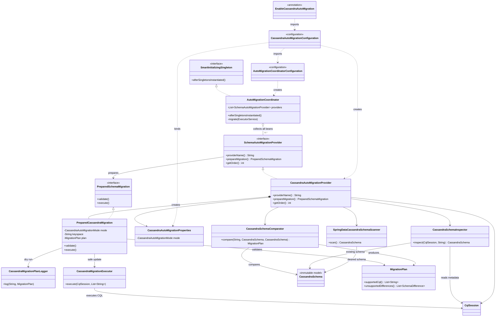
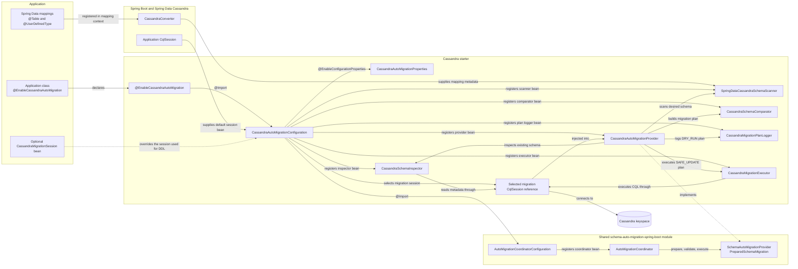
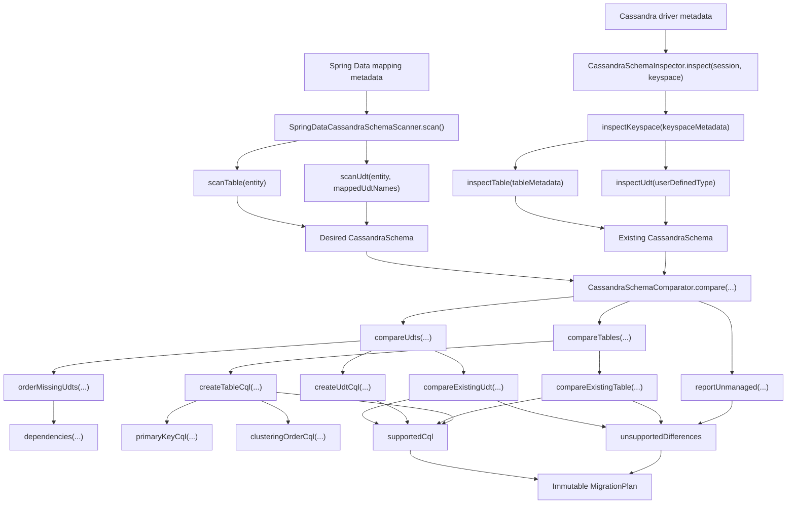

# Architecture

This document describes the repository-wide runtime architecture. The
`schema-auto-migration-spring-boot` module owns the provider-independent startup
lifecycle, while `schema-auto-migration-cassandra-spring-boot-starter` contributes the
Cassandra implementation. Future database modules join the same lifecycle by
implementing the core provider contracts.

The starter is explicitly activated. Adding the dependency does not scan mappings or
execute CQL until an application class is annotated with
`@EnableCassandraAutoMigration`.

## Architecture at a glance

Read this diagram from the activation annotation down to the Cassandra execution
components. The classes in the core module are database-independent; everything below
`CassandraAutoMigrationProvider` belongs to the Cassandra provider.



The shortest path through the startup flow is:

1. `@EnableCassandraAutoMigration` imports the Cassandra configuration.
2. The configuration registers the Cassandra provider and the shared coordinator.
3. Spring injects every registered `SchemaAutoMigrationProvider` bean into the
   coordinator, creating those provider beans first as dependencies.
4. Spring calls `afterSingletonsInstantiated()` after regular singleton creation.
5. The coordinator prepares providers concurrently, then validates every prepared plan.
6. Only when global validation succeeds does it execute providers concurrently; each
   provider preserves the ordering required by its own database operations.

## Design invariants

- Plan first, validate the complete plan, and only then execute it.
- Never execute a provider when any provider fails planning or validation.
- Generate only additive Cassandra DDL; report destructive or ambiguous differences
  as unsupported.
- Keep generated plans deterministic so dry-run output is reviewable.
- Run different database providers concurrently, but keep dependent Cassandra DDL
  statements sequential.
- Reuse Spring Boot's `CqlSession` by default without taking lifecycle ownership.
- Require the target keyspace to exist; keyspace and replication management stay
  outside this library.

## Module and bean graph



`@EnableCassandraAutoMigration` is metadata, not an object that directly calls the
migration code. Spring reads its `@Import(CassandraAutoMigrationConfiguration.class)`
declaration while processing configuration classes. The imported configuration then
registers the beans that eventually perform migration.

There is intentionally no `AutoConfiguration.imports` or `spring.factories` activation
path in this module. Explicit annotation opt-in is the activation boundary.

## Bean registration

`CassandraAutoMigrationConfiguration` uses `@Configuration(proxyBeanMethods = false)`.
Its factory methods are dependency-driven bean factories; their source order is not a
runtime ordering guarantee.

| Factory method | Important inputs | Created bean and role |
| --- | --- | --- |
| `cassandraMigrationSchemaScanner(...)` | `CassandraConverter` | Builds the desired schema from Spring Data mappings. |
| `cassandraMigrationSchemaInspector()` | None | Reads the existing keyspace schema from driver metadata. |
| `cassandraMigrationSchemaComparator()` | None | Produces supported CQL and unsupported differences. |
| `cassandraMigrationExecutor()` | None | Executes validated CQL sequentially and checks schema agreement. |
| `cassandraMigrationPlanLogger()` | None | Writes deterministic `DRY_RUN` output. |
| `cassandraAutoMigrationProvider(...)` | Properties, session, scanner, inspector, comparator, executor, logger | Adapts Cassandra to the shared provider contract. |
| `autoMigrationCoordinator(...)` | Every `SchemaAutoMigrationProvider` bean | Starts the plan, validate, and execute lifecycle after singleton creation. |

Every factory method above is guarded by `@ConditionalOnMissingBean`. An application
can replace one component without replacing the rest of the pipeline.

### Session selection

`cassandraAutoMigrationProvider(...)` resolves the migration session as follows:

1. Ask `ObjectProvider<CassandraMigrationSession>.getIfAvailable(...)` for an
   application-provided migration session.
2. If none exists, wrap Spring Boot's application `CqlSession` with
   `CassandraMigrationSession.of(applicationSession)`.
3. Extract the non-null `CqlSession` and inject it into
   `CassandraAutoMigrationProvider`.

`CassandraMigrationSession.of(...)` does not close the wrapped application session.
When declared as a bean, `CassandraMigrationSession.owned(...)` is intended for a
dedicated DDL session whose lifecycle belongs to the Spring context.

## Startup call flow

The shared coordinator implements `SmartInitializingSingleton`. Spring calls
`afterSingletonsInstantiated()` after regular singleton creation and before lifecycle
components begin accepting work.

### Planning

```mermaid
sequenceDiagram
    autonumber
    participant Spring as Spring BeanFactory
    participant Coordinator as AutoMigrationCoordinator
    participant Provider as CassandraAutoMigrationProvider
    participant Properties as CassandraAutoMigrationProperties
    participant Session as CqlSession
    participant Inspector as CassandraSchemaInspector
    participant Scanner as SpringDataCassandraSchemaScanner
    participant Comparator as CassandraSchemaComparator

    Spring->>Coordinator: afterSingletonsInstantiated()
    Coordinator->>Coordinator: create fixed daemon thread pool
    Coordinator->>Coordinator: migrate(executorService)
    Note over Coordinator,Provider: Each provider preparation is scheduled with CompletableFuture.supplyAsync
    Coordinator->>Provider: prepareMigration()
    Provider->>Properties: getMode()
    Properties-->>Provider: NONE, DRY_RUN, or SAFE_UPDATE

    alt mode is NONE
        Provider-->>Coordinator: PreparedSchemaMigration.noOp()
    else mode is DRY_RUN or SAFE_UPDATE
        Provider->>Provider: SpringBootCompatibility.verifySupported()
        Provider->>Provider: resolveKeyspace()
        Provider->>Session: getKeyspace()
        Session-->>Provider: configured keyspace
        Provider->>Session: refreshSchema()

        Provider->>Inspector: inspect(session, keyspace)
        Inspector->>Session: getMetadata().getKeyspace(keyspaceId)
        Inspector->>Inspector: inspectKeyspace(metadata)
        Inspector->>Inspector: inspectTable(...) and inspectUdt(...)
        Inspector-->>Provider: existing CassandraSchema

        Provider->>Scanner: scan()
        Scanner->>Scanner: mappingContext.getPersistentEntities()
        Scanner->>Scanner: scanTable(...) and scanUdt(...)
        Scanner-->>Provider: desired CassandraSchema

        Provider->>Comparator: compare(keyspace, desired, existing)
        Comparator-->>Provider: MigrationPlan
        Provider-->>Coordinator: new PreparedCassandraMigration(mode, keyspace, plan)
    end
```

`NONE` returns before the compatibility check, keyspace lookup, metadata refresh,
mapping scan, and comparison. Enabled modes fail planning when the Spring Boot version
is unsupported, the session has no configured keyspace, or the keyspace cannot be
found.

### Validation and execution

```mermaid
sequenceDiagram
    autonumber
    participant Spring as Spring BeanFactory
    participant Coordinator as AutoMigrationCoordinator
    participant Prepared as PreparedSchemaMigration
    participant Provider as CassandraAutoMigrationProvider
    participant PlanLogger as CassandraMigrationPlanLogger
    participant Executor as CassandraMigrationExecutor
    participant Session as CqlSession
    participant Cassandra as Cassandra cluster

    Note over Coordinator,Prepared: Successful preparations are validated sequentially in provider order
    Coordinator->>Prepared: validate()

    alt DRY_RUN
        Prepared->>PlanLogger: log(keyspace, plan)
        Prepared->>Provider: failIfUnsupported(plan)
    else SAFE_UPDATE
        Prepared->>Provider: reportUnsupported(plan)
        Prepared->>Provider: failIfUnsupported(plan)
    else NONE
        Note over Prepared: no-op validation
    end

    alt any planning or validation failed
        Coordinator-->>Spring: throw aggregated IllegalStateException
        Note over Coordinator,Spring: No provider execution is scheduled
    else every provider is valid
        Note over Coordinator,Prepared: Each provider execution is scheduled with CompletableFuture.runAsync
        Coordinator->>Prepared: execute()

        alt mode is not SAFE_UPDATE
            Prepared-->>Coordinator: return without CQL
        else plan is empty or has no supported CQL
            Prepared-->>Coordinator: log and return
        else SAFE_UPDATE has supported CQL
            Prepared->>Provider: failIfUnsupported(plan)
            Prepared->>Executor: execute(session, plan.supportedCql())
            loop statements in deterministic order
                Executor->>Session: execute(statement)
                Session->>Cassandra: apply additive DDL
                Cassandra-->>Session: execution result
                Session-->>Executor: ResultSet
                Executor->>Executor: isSchemaInAgreement()
            end
            Executor-->>Prepared: all statements completed
            Prepared-->>Coordinator: execution completed
        end

        Coordinator-->>Spring: all execution futures joined
    end
```



The second `failIfUnsupported(plan)` inside `execute()` is a defensive guard. Normal
coordinator flow has already called `validate()` before reaching it.

## Schema planning internals

The scanner and inspector intentionally produce the same immutable model shape. This
keeps comparison independent from Spring Data mapping objects and Cassandra driver
metadata objects.



### Desired schema scanning

`SpringDataCassandraSchemaScanner.scan()` performs these steps:

1. Obtain the active `CassandraMappingContext` from `CassandraConverter`.
2. Collect mapped UDT names so nested UDT type references can be quoted correctly.
3. Sort persistent entities by Java type name for deterministic output.
4. Call `scanUdt(...)` for user-defined types.
5. Call `scanTable(...)` for types annotated with Spring Data's `@Table`.
6. Return an immutable `CassandraSchema` containing tables and UDTs.

`scanTable(...)` delegates to
`SchemaFactory.getCreateTableSpecificationFor(entity)`, then records columns,
partition keys, clustering keys, clustering order, static-column flags, and rendered
CQL types. `scanUdt(...)` delegates to
`SchemaFactory.getCreateUserTypeSpecificationFor(entity)` and parses each public
Spring Data `FieldSpecification` into a normalized field definition.

### Existing schema inspection

`CassandraSchemaInspector.inspect(...)` reads the keyspace through
`session.getMetadata()`. `inspectKeyspace(...)` sorts tables and UDTs by identifier,
then `inspectTable(...)` and `inspectUdt(...)` convert driver metadata into the same
`CassandraSchema` model used by the scanner.

Table scanning and driver inspection use `CqlDataTypeRenderer.render(...)`. UDT
scanning preserves Spring Data's rendered field type and normalizes mapped UDT names.
Together these paths keep nested collections, tuples, vectors, frozen values, and UDT
references comparable.

### Comparison and ordering

`CassandraSchemaComparator.compare(...)` builds two lists:

- `supportedCql`: additive statements that may be executed in order.
- `unsupportedDifferences`: differences that make validation fail.

Missing UDTs are topologically ordered by `orderMissingUdts(...)` before their create
statements are emitted. A cyclic dependency between missing mapped UDTs fails planning.
UDT work is added before table work. Names are quoted through `CqlNames`, and
`sameType(...)` canonicalizes whitespace, case, and the Cassandra `varchar`/`text`
alias before comparing types.

## Migration modes

| Mode | `prepareMigration()` | `validate()` | `execute()` |
| --- | --- | --- | --- |
| `NONE` | Immediately returns `PreparedSchemaMigration.noOp()`. | No-op. | No-op. |
| `DRY_RUN` | Inspects, scans, and creates a plan. | Logs the full ordered plan, then fails if unsupported differences exist. | Returns without executing CQL. |
| `SAFE_UPDATE` | Inspects, scans, and creates a plan. | Reports unsupported differences and fails if any exist. | Executes supported CQL only after global validation succeeds. |

The property binding prefix is `schema-auto-migration.cassandra`; `mode` defaults to
`NONE`.

## Safety boundary

| Difference | Result |
| --- | --- |
| Missing UDT | `CREATE TYPE IF NOT EXISTS` |
| Missing UDT field | `ALTER TYPE ... ADD IF NOT EXISTS` |
| Missing table | `CREATE TABLE IF NOT EXISTS` |
| Missing non-key column | `ALTER TABLE ... ADD IF NOT EXISTS` |
| Missing primary-key column on an existing table | Reject as `MODIFY_PRIMARY_KEY` |
| Changed partition or clustering key | Reject as `MODIFY_PRIMARY_KEY` |
| Changed clustering order | Reject as `CHANGE_CLUSTERING_ORDER` |
| Changed column type or regular/static kind | Reject as `CHANGE_COLUMN_TYPE` or `CHANGE_COLUMN_KIND` |
| Changed UDT field type | Reject as `CHANGE_UDT_FIELD_TYPE` |
| Unmapped existing table, UDT, column, or UDT field | Reject as a required drop |

The provider does not manage keyspaces, replication, indexes, materialized views,
table options, data backfills, or migration history.

## Concurrency and failure semantics

- The coordinator sorts providers with `AnnotationAwareOrderComparator`.
- Provider planning uses `CompletableFuture.supplyAsync(...)` on a fixed daemon thread
  pool sized to the provider count.
- The coordinator joins every planning task and aggregates failures. It still validates
  successfully prepared providers so all pre-execution errors can be reported together.
- Validation is sequential in provider order. Any planning or validation failure blocks
  execution for every provider.
- Provider execution uses `CompletableFuture.runAsync(...)`. Different providers may
  execute concurrently after global validation.
- `CassandraMigrationExecutor.execute(...)` executes this provider's CQL one statement
  at a time and checks schema agreement after every statement.
- An execution failure is aggregated by the coordinator, but another provider may
  already be executing concurrently. Cross-provider execution is not transactional.
- Cassandra DDL is not wrapped in a rollback transaction. If a later statement fails,
  earlier successful statements remain applied. Generated additive statements use
  `IF NOT EXISTS`, allowing a later startup to reconcile the remaining work.
- Planning, validation, and execution exceptions are wrapped with the provider name and
  phase. Additional failures are attached as suppressed exceptions.
- The coordinator always shuts down its temporary executor in `finally`.

## Key classes

| Class | Main methods | Responsibility |
| --- | --- | --- |
| `EnableCassandraAutoMigration` | Annotation metadata | Imports the Cassandra configuration. |
| `CassandraAutoMigrationConfiguration` | `cassandraMigrationSchemaScanner`, `cassandraMigrationSchemaInspector`, `cassandraMigrationSchemaComparator`, `cassandraMigrationExecutor`, `cassandraMigrationPlanLogger`, `cassandraAutoMigrationProvider` | Registers replaceable Cassandra beans and selects the migration session. |
| `AutoMigrationCoordinatorConfiguration` | `autoMigrationCoordinator` | Registers the shared startup coordinator. |
| `AutoMigrationCoordinator` | `afterSingletonsInstantiated`, `migrate`, `prepare` | Coordinates provider planning, global validation, execution, and failure aggregation. |
| `CassandraAutoMigrationProvider` | `prepareMigration`, `resolveKeyspace`, `reportUnsupported`, `failIfUnsupported` | Owns Cassandra mode behavior and creates an immutable prepared migration. |
| `PreparedCassandraMigration` | `validate`, `execute` | Separates pre-execution validation from side effects. |
| `SpringDataCassandraSchemaScanner` | `scan`, `scanTable`, `scanUdt` | Converts application mappings into the desired schema. |
| `CassandraSchemaInspector` | `inspect`, `inspectKeyspace`, `inspectTable`, `inspectUdt` | Converts live driver metadata into the existing schema. |
| `CassandraSchemaComparator` | `compare` and comparison/CQL helpers | Produces deterministic additive CQL and unsupported differences. |
| `CassandraMigrationPlanLogger` | `log` | Logs the complete dry-run plan to `io.github.nguyenductrongdev.automigration.plan.cassandra`. |
| `CassandraMigrationExecutor` | `execute` | Applies CQL sequentially and enforces schema agreement. |
| `CassandraMigrationSession` | `cqlSession`, `of`, `owned` | Supports default or dedicated DDL credentials and session ownership. |
| `CassandraSchema` and definition records | Record accessors | Form the immutable normalized schema model. |
| `MigrationPlan` and `SchemaDifference` | Record accessors | Carry executable CQL and validation failures between phases. |

## Extension points

- Declare a replacement scanner, inspector, comparator, logger, executor, provider, or
  coordinator bean; `@ConditionalOnMissingBean` keeps the default from being registered.
- Declare one `CassandraMigrationSession` bean to use separate DDL credentials.
- Implement `SchemaAutoMigrationProvider` in another module to join the same global
  plan, validate, and execute lifecycle.
- Set provider ordering through `Ordered`; the Cassandra provider currently returns
  order `100`.

When adding a new migration capability, preserve the phase boundary: remote inspection
and plan construction belong in `prepareMigration()`, side-effect-free rejection belongs
in `validate()`, and database writes belong only in `execute()`.
